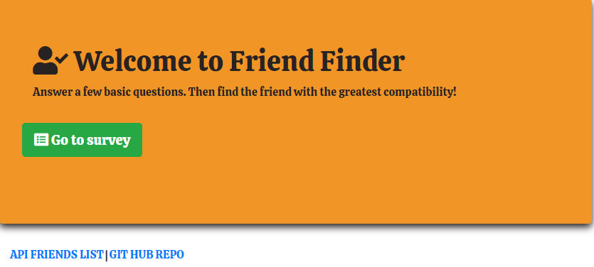

# FRIEND FINDER

This full-stack site will take in results from your users' surveys, then compare their answers with those from other users. The app will then display the name and picture of the user with the best overall match.

# How works
The user must fill it out the complete survey if it dont the app will show an error.
Once the completed the survey can see the best match with your answer.Click on API FRIEND LIST will see the information that other users 

# Tecnologies

Express

jquery

nodemon

Heroku

# Demo link
https://friend-heroku18.herokuapp.com/
